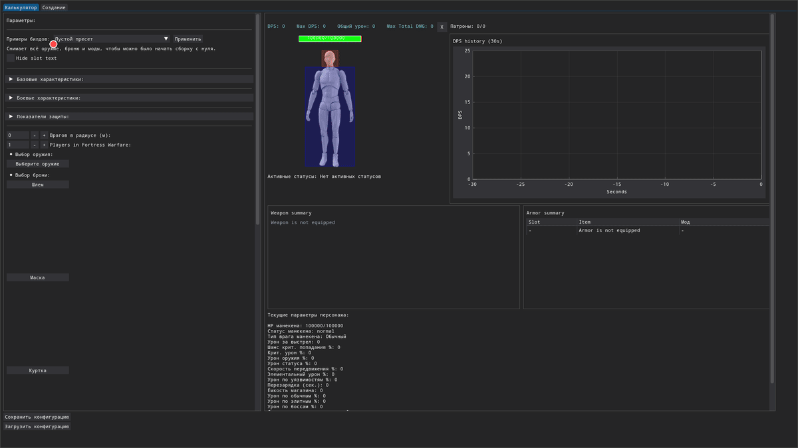
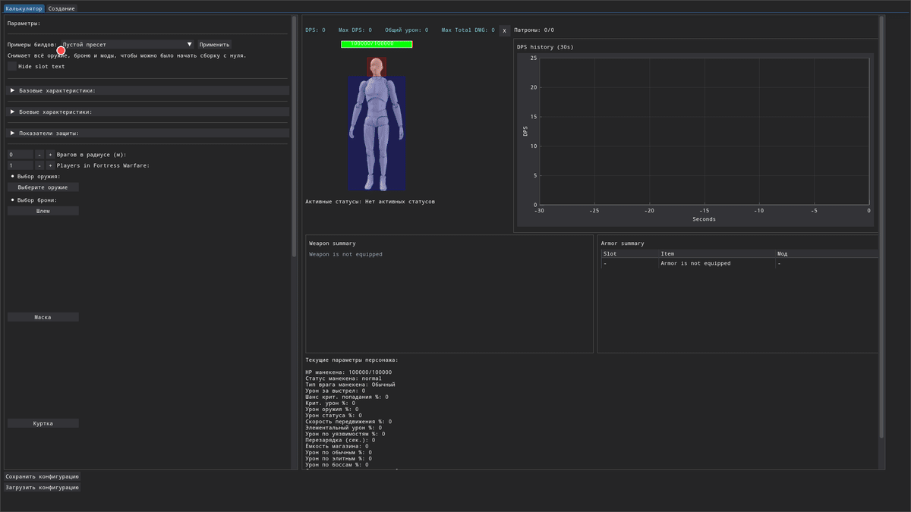

# Once Human Tools

Choose the documentation language:

- [README in Russian](README_ru.md)
- [README in English](README_en.md)

## Calculator Preview

### 1. Presets And Compact Layout

### 2. Weapon And Armor Setup

### 3. Mods And Secondary Attributes

### 4. Dummy Settings And DPS Graph

## Policies

- [Политика использования на русском](README_policy_ru.md)
- [Usage policy in English](README_policy_en.md)

## Data tools

- [Инструменты для данных на русском](tools/README_ru.md)
- [Data tools in English](tools/README_en.md)

## Decompile pipeline

- [Автоматическая декомпиляция Once Human](tools/DECOMPILE_PIPELINE_ru.md)
- [Automatic Once Human Decompile Pipeline](tools/DECOMPILE_PIPELINE_en.md)
